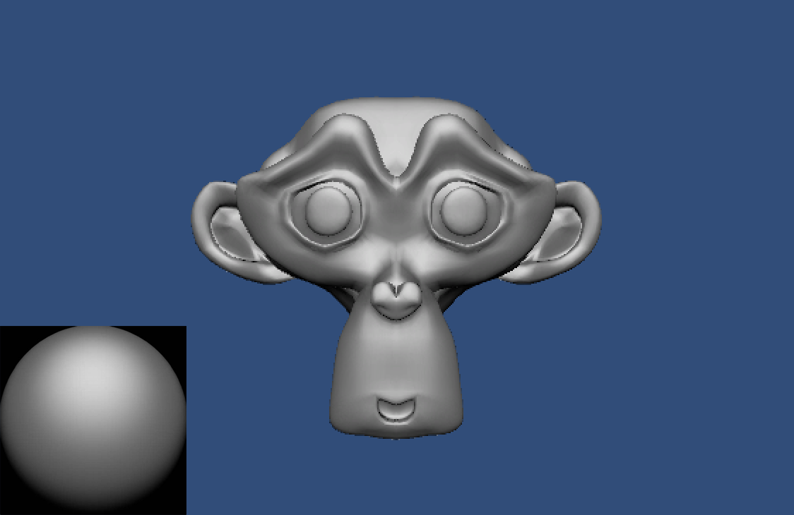
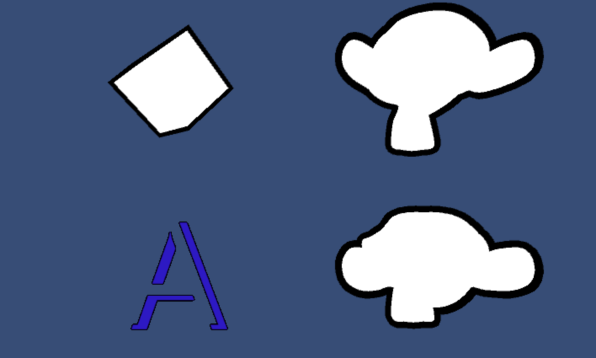
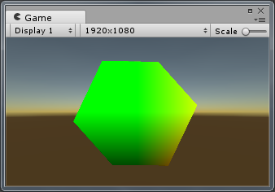

## 07_MatCap

使用一张纹理作为参考，渲染物体时获取其在view空间的法线到纹理中去采样获取漫反射到颜色。如下边的模型是使用左侧的纹理来采样绘制出来的：

***
## 06_RampTexture

计算光照强度并在渐变纹理中采样，以模拟漫反射光照。

***
## 05_Outlining

描边shader。前三个绘制描边都是基于模板缓冲区，立方体的shader使用对模型缩放的方法，两个猴子分别使用在世界空间和观察空间偏移顶点的方法，左下角的图片（sprite）使用像素偏移的方法。

***
## 04_ModelAlphaBlend

在模型中使用AlphaBlend，三个半透明的shader，从左到右依次是绘制双面、带深度绘制、使用Fresnel效果。

***
## 03_RadarImage

基于shader在UGUI中绘制雷达图。在vert中修改Image的顶点，并根据位置在frag中计算片段透明度。使用脚本驱动雷达图动画。

***
## 02_ShowVerts

借助几何着色器，在绘制时只显示顶点。

***
## 01_FragWorldPos

在片段着色器中获取世界坐标，并将坐标作为颜色输出。后处理阶段根据深度纹理解算出来像素对应的世界坐标，可用于做边界检测、运动模糊等效果。

透视相机，直接使用世界坐标绘制物体。

透视相机，在后处理阶段计算世界坐标并显示出来。

正交相机，直接使用世界坐标绘制物体。

正交相机，在后处理阶段计算世界坐标并显示出来。

后处理阶段，借助深度纹理获取世界坐标时，使用了两种不同的计算方法，详见相关代码。
***
